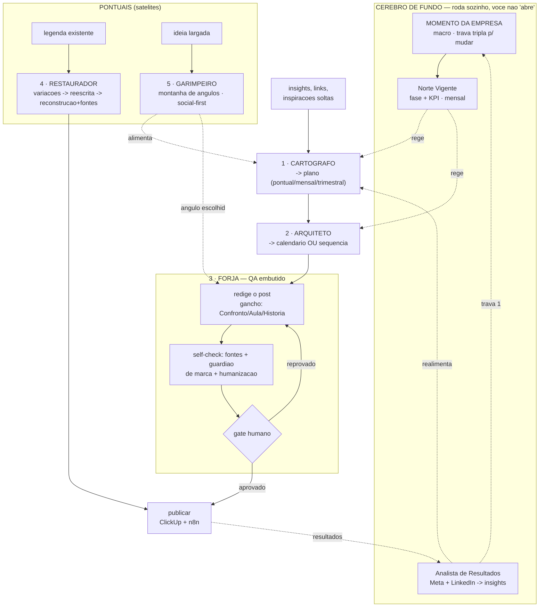

# ODuo Content System — Fluxograma

**5 ferramentas que você aciona** + **1 cérebro que roda sozinho no fundo.**

Você nunca "abre" o Norte Vigente nem o Analista de Resultados — eles são o ambiente.
Você abre **uma de cinco ferramentas**, sempre sabendo qual:

| Preciso de… | Ferramenta |
|---|---|
| transformar ideias soltas em **plano** | **1 · Cartógrafo** |
| transformar o plano em **calendário/sequência** | **2 · Arquiteto** |
| transformar uma linha em **post pronto** | **3 · Forja** |
| **reaproveitar/reescrever** uma legenda existente | **4 · Restaurador** (pontual) |
| explodir uma ideia em **muitos ângulos virais** | **5 · Garimpeiro** (pontual) |

> **1 → 2 → 3** é a esteira linear. **4 e 5 são satélites** — entram quando você quer e não
> ficam ilhados. Precedência de governança: **Momento da Empresa → Norte Vigente → Cadernos → Tom de Voz.**

---

## Diagrama

---

## Cérebro de fundo (não é um passo)

- **Momento da Empresa** — macro-fase estratégica; muda RARAMENTE. Protegido pela **Trava Tripla**:
  (1) **Dado** — o Analista detecta mudança estrutural sustentada; (2) **Estratégia** — o fundador confirma;
  (3) **Coerência** — é Momento novo, não só ajuste de Norte. Só muda com **3/3**.
- **Norte Vigente** — fase + KPI do mês, sempre alinhado ao Momento. Hoje (jun/2026): Fase 1 (topo puro), KPI custo/MQL.
- **Analista de Resultados** — lê Meta Business + LinkedIn, vira insight, realimenta o Cartógrafo, o Norte e a Trava 1.

---

## 1 · Cartógrafo — insights soltos → plano

- **Modo (dial):** `pontual` (uma ação/campanha rápida) · `mensal` · `trimestral`.
- **Entrada:** insights, links, prints, reclamações, resultados, ideias soltas.
- **Ferramentas:** ClickUp (contexto + performance) · WebSearch/Semrush (expande opções de mercado).
- **Processo:** carrega Norte + Documento Base → organiza o brainstorm → cruza com mercado
  (Alinhadas/Contraditórias/Lacunas) → gera **3 planos** (Conservador/Equilibrado/Agressivo) + recomendação →
  expande o escolhido na escala do Modo.
- **Saída — Contrato 1 · Plano:** cabeçalho + Foco / Fase / Eixos (→ Pilares) / KPI / Marcos / Proporção de formato / Léxico.
- **Guardrail:** dado de mercado só com URL; o Norte rege o mix. **Para no plano** (não escreve calendário nem post).
- **Handoff →** Arquiteto.

## 2 · Arquiteto — plano → calendário/sequência

- **Modo (dial):** `calendário do mês` ↔ `sequência temática`.
- **Entrada:** Contrato 1 aprovado.
- **Processo:** deriva volume da fase → distribui mix **70/20/10** → cruza **matriz editoria × formato**
  (sem repetir par) → gera o **ângulo** de cada linha → sequencia em datas/canais.
- **Saída — Contrato 2 · Calendário/Sequência:** linhas `Dia / Formato / Canal / Título / Resumo / Editoria / Fase`.
- **Guardrail:** respeita o mix do Norte; cada linha mapeia a um Pilar; zero repetição de par.
- **Handoff →** Forja.

## 3 · Forja — uma linha → post pronto (QA embutido)

- **Modo (dial):** gancho `Confronto / Aula / História`; modulação **Sábio OU Criador** (nunca os dois no mesmo post).
- **Entrada:** UMA linha do Contrato 2.
- **Processo:** classifica o gancho → ramifica por formato (Carrossel / Estático / Reels / Story / Blog) →
  escreve as legendas por canal (3–6 parágrafos, último = CTA na temperatura da fase).
- **Self-check embutido (antes do gate):**
  1. **Fontes** — todo dado externo com URL verificada; sem URL → "a verificar", não publica.
  2. **Guardião de marca** — blacklist + regras duras (Camada 3) + qual pilar sustenta + língua do canteiro.
  3. **Humanização** — texturas de legenda (ritmo irregular, frase curta, sem corporativês).
  4. **Self-check de 12 itens** do Contrato 3.
- **Gate humano:** aprova → publica · reprova → volta com nota.
- **Saída — Contrato 3 · Post completo** (texto na imagem + descrição + legendas por canal).

## 4 · Restaurador — legenda existente → nova versão *(pontual)*

- **Modo (dial):** `Nível 1 · Variações` (mesma legenda em N reescritas/tons/tamanhos) →
  `Nível 2 · Reescrita` (reestrutura com ganchos e gatilhos melhores) →
  `Nível 3 · Reconstrução` (conteúdo completo com pesquisa + fontes verificadas via WebSearch).
- **Entrada:** uma legenda já publicada ou um rascunho.
- **Lê:** Tom de Voz + Humanização (+ Documento Base para provas). Mesmas regras duras da Forja; Nível 3 exige URL.
- **Handoff →** publicar, ou volta ao self-check da Forja se mudou muito.

## 5 · Garimpeiro — ideia largada → montanha de ângulos *(pontual)*

- **Lente:** **SOCIAL-FIRST** — pensa em **como a mídia funciona** (gancho nos 2s, retenção, tendência,
  formato, salvamento/compartilhamento), **não em como a ODuo funciona**.
- **Modo (dial):** volume (ex.: `20` ou `50+` ângulos).
- **Entrada:** uma ideia largada.
- **Processo:** explode a ideia em muitos ângulos virais e os **ranqueia por potencial**.
  **Marca em vermelho** todo ângulo que conflita com a Bíblia — afrouxa a marca de propósito, mas sinaliza.
- **Guardrail:** nada publica direto. Sempre passa pelo humano ou pela Forja (que reaplica a marca).
- **Handoff →** Cartógrafo (vira matéria-prima de plano) ou Forja (ângulo escolhido → post).

---

## Convenção de handoff (a cola entre as ferramentas)

Toda saída é um **Contrato** — bloco copiável com um **cabeçalho que viaja**
(`Dia / Formato / Canal / Editoria / Fase`). O passo seguinte começa com contexto; você não reexplica nada.
Onde mora: cada Contrato pode ser uma task no **ClickUp** (status Produção → QA → Gate → Agendado);
o **n8n** move os Contratos automaticamente quando você quiser automatizar.

## De onde viemos (continuidade com os prompts atuais)

| Antes | Agora |
|---|---|
| Chat 1 · Estratégia | **1 · Cartógrafo** |
| Chat 2 · Calendário | **2 · Arquiteto** |
| Chat 3 · Post + Chat 4 Fontes + Chat 5 Humanização | **3 · Forja** (QA embutido) |
| — (novo) | **4 · Restaurador** |
| — (Radar/Ângulos, novo) | **5 · Garimpeiro** |
| Chat 6 · Analista | **Cérebro de fundo** (Analista de Resultados) |

**Adiado:** Curador de Provas (banco de cases verificáveis) — por ora a prova fica no self-check da Forja.

**Ferramentas conectadas (MCP):** ClickUp · Gamma · Figma · n8n · Semrush.
